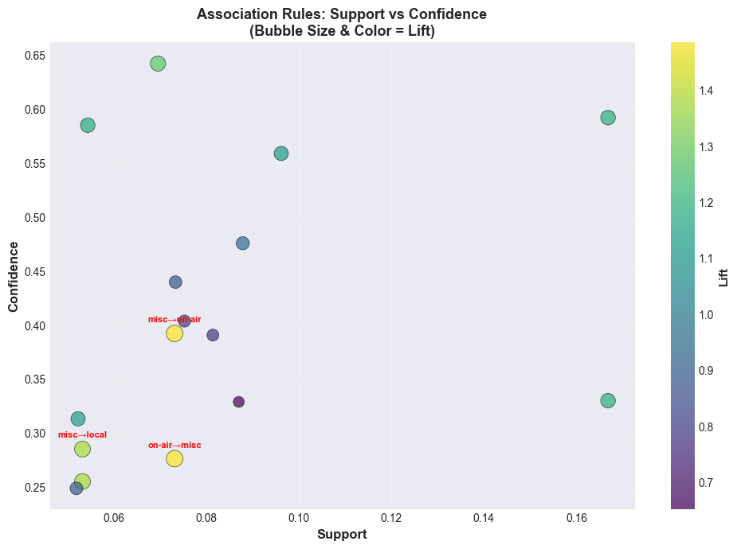
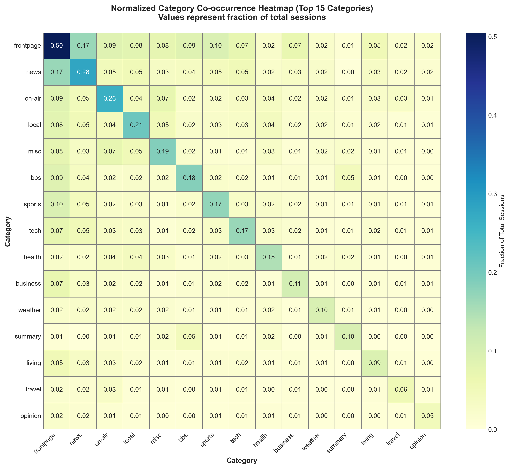

# Website User Navigation Pattern Analysis: Association Rule Mining on MSNBC.com Clickstream Data

**CSC172 Data Mining Project**  
*Mindanao State University - Iligan Institute of Technology*  
**Student:** Ian Gabriel D. Paulmino, 2022-1729  
**Semester:** AY 2025-2026, 1st Semester  

[](https://python.org) [](https://pandas.pydata.org) [](http://rasbt.github.io/mlxtend/)

## Abstract

This project implements a comprehensive association rule mining pipeline using the Apriori algorithm to discover navigational patterns in website clickstream data from MSNBC.com. Leveraging anonymous user session data containing 989,818 raw sessions across 17 content categories, the analysis applies rigorous data cleaning and preprocessing to extract 364,384 valid transactions. Through exploratory data analysis (EDA), optimal frequency thresholds are established, and the Apriori algorithm generates frequent itemsets with minimum support of 1.5%. Association rules are subsequently generated using lift, confidence, and leverage metrics to identify meaningful content navigation relationships. Key findings reveal strong user navigation patterns (e.g., news → local news, frontpage → business), with actionable recommendations for content recommendation systems, website layout optimization, and targeted navigation design. The project demonstrates end-to-end association mining from raw data to interpretable business insights, with documented limitations regarding temporal sequence and cross-session behavior.

**Keywords:** Association Rule Mining, Apriori Algorithm, Clickstream Analysis, Web Usage Mining, E-commerce/Website Optimization, Machine Learning

---

## Table of Contents

- [Abstract](#abstract)
- [Introduction](#introduction)
- [Data Structure & Acquisition](#data-structure--acquisition)
- [Data Preprocessing](#data-preprocessing)
- [Exploratory Data Analysis (EDA)](#exploratory-data-analysis-eda)
- [Apriori Implementation](#apriori-implementation)
- [Key Visualizations](#key-visualizations)
- [Performance Metrics & Results](#performance-metrics--results)
- [Discussion](#discussion)
- [Limitations & Conclusions](#limitations--conclusions)
- [Installation & Usage](#installation--usage)
- [References](#references)

---

## Introduction

### Problem Statement

Modern websites generate massive volumes of clickstream data as users navigate between pages. Understanding which content pages are visited together (co-occurrence patterns) is crucial for:

1. **Content Recommendation:** Suggest relevant pages to users based on their browsing history
2. **Website Layout Optimization:** Position related content strategically to improve user journey
3. **A/B Testing & UX Design:** Identify unexpected navigation patterns requiring design intervention
4. **Revenue Maximization:** Place high-value content in proximity to frequently visited pages

Traditional click analytics provide aggregate statistics (e.g., "Page X was viewed 50,000 times"), but lack insight into *which combinations* of pages users visit together. Association rule mining fills this gap by discovering statistically significant page co-occurrences, enabling data-driven site optimization.

### Objectives

1. **Process & Clean:** Load, deduplicate, and filter 989,818 raw sessions into 364,384 valid transactions (36.8% retention after outlier removal)
2. **Analyze:** Perform EDA to understand item frequency, transaction size distribution, and category co-occurrence patterns
3. **Mine:** Apply Apriori algorithm with optimized support threshold (1.5%) to generate frequent itemsets and association rules
4. **Interpret:** Extract actionable rules ranked by lift, confidence, and leverage to identify navigation bottlenecks
5. **Visualize:** Create decision rules, support-confidence plots, and category heatmaps to communicate findings

### Relevance

The dataset (MSNBC.com clickstream data from UCI Repository) represents a real-world, industry-scale problem. Results inform website optimization strategies used by Amazon, Netflix, YouTube, and other recommendation-driven platforms.

---

## Data Structure & Acquisition

### Source & Dataset Characteristics

| Attribute | Value |
|-----------|-------|
| **Source** | MSNBC.com Anonymous Web Data ([UCI ML Repository](https://archive.ics.uci.edu/ml/datasets/MSNBC.com+Anonymous+Web+Data)) |
| **Collection Date** | September 28, 1999 (single day snapshot) |
| **Raw Sessions** | 989,818 user sessions |
| **Time Window** | 24-hour period |
| **Session Definition** | All pages viewed by a user during the 24-hour window |
| **Content Categories** | 17 (see mapping below) |
| **Data Format** | Sequential numeric codes (1-17), space-separated |

### Category Mapping

Each page is assigned to one of 17 content categories:

| Code | Category | Code | Category |
|------|----------|------|----------|
| 1 | frontpage | 10 | living |
| 2 | news | 11 | business |
| 3 | tech | 12 | sports |
| 4 | local | 13 | summary |
| 5 | opinion | 14 | bbs |
| 6 | on-air | 15 | travel |
| 7 | misc | 16 | msn-news |
| 8 | weather | 17 | msn-sports |
| 9 | health | — | — |

### Sample Transactions (After Cleaning)

```
Transaction 1:  [tech, news, local, news, tech]  (5 pages)
Transaction 2:  [on-air, misc, on-air, weather]  (4 pages)
Transaction 3:  [on-air, health, local, living, tech, living, opinion, living, local]  (9 pages)
Transaction 4:  [business, frontpage]  (3 pages, after dedup)
Transaction 5:  [health, sports]  (2 pages)
```

---

## Data Preprocessing

### Cleaning Strategy

Raw clickstream data contains noise and outliers (e.g., bot sessions with 1,000+ page views). A five-step cleaning pipeline was applied:

#### Step 1: Code Validation & Name Conversion
- Validate all numeric codes are in range [1, 17]
- Convert codes to human-readable category names
- Remove sessions with invalid codes (0 removed in this dataset)

#### Step 2: Consecutive Duplicate Removal
- Remove consecutive identical categories (same page visited twice in a row)
- Represents page refreshes, not new navigation decisions
- **Rationale:** Users refreshing a page don't indicate a new interest

#### Step 3: Minimum Transaction Size Filtering
- Remove sessions with fewer than 2 distinct categories
- **Rationale:** Single-page sessions cannot indicate association
- **Result:** 601,384 sessions removed (60.7%)

#### Step 4: Content Filtering (Optional)
- Remove sessions containing *only* frontpage visits
- Identifies bounce-only traffic with no content engagement
- **Result:** 0 removed (all sessions with 2+ categories visited actual content)

#### Step 5: Outlier Detection & Removal (IQR Method)
- Calculate Q1 (25th percentile), Q3 (75th percentile)
- Define outliers as sessions outside [Q1 - 1.5×IQR, Q3 + 1.5×IQR]
- **Rationale:** Remove bot traffic and session aggregation errors

| Metric | Raw Data | After Cleaning |
|--------|----------|-----------------|
| **Total Sessions** | 989,818 | 364,384 |
| **Q1 (25th %ile)** | 1 | 2 |
| **Q3 (75th %ile)** | 5 | 4 |
| **IQR** | 4 | 2 |
| **Outlier Threshold** | [Q1-1.5×IQR, Q3+1.5×IQR] | [-2.5, 9.5] |
| **Outliers Removed** | — | 24,050 |
| **Mean Pages/Session** | 4.75 | 3.55 |
| **Median Pages/Session** | 2 | 3 |
| **Max Pages/Session** | 14,795 → | 9 |
| **Retention Rate** | — | 36.8% |

### Cleaned Data Statistics

```
FINAL DATA PROCESSING SUMMARY

Pipeline:
  1. Raw sessions loaded: 989,818
  2. Removed invalid codes: 0
  3. Removed single-page sessions: 601,384
  4. Removed frontpage-only sessions: 0
  5. Removed outlier sessions (IQR): 24,050
  
Final valid transactions: 364,384
Overall retention rate: 36.81%

Session Length Distribution (After Cleaning):
  - Min: 2 pages
  - Max: 9 pages
  - Mean: 3.55 pages
  - Median: 3 pages
  - Std Dev: 1.80 pages
```

---

## Exploratory Data Analysis (EDA)

### 1. Item Frequency Analysis

Analyzing which content categories appear most frequently across all transactions:

| Rank | Category | # Sessions | % Sessions | Support |
|------|----------|-----------|----------|---------|
| 1 | **frontpage** | 183,982 | 50.49% | 0.5049 |
| 2 | **news** | 102,662 | 28.17% | 0.2817 |
| 3 | **on-air** | 96,287 | 26.42% | 0.2642 |
| 4 | **local** | 75,866 | 20.82% | 0.2082 |
| 5 | **misc** | 67,892 | 18.63% | 0.1863 |
| 6 | **bbs** | 67,278 | 18.46% | 0.1846 |
| 7 | **weather** | 65,144 | 17.88% | 0.1788 |
| 8 | **tech** | 60,891 | 16.71% | 0.1671 |
| 9 | **health** | 59,478 | 16.33% | 0.1633 |
| 10 | **sports** | 58,932 | 16.18% | 0.1618 |

**Key Insight:** Frontpage dominance (50.5%) reflects landing page traffic. News (28.2%) and on-air (26.4%) represent core content drivers.

### 2. Transaction Size Distribution

Understanding how many pages users visit per session:

```
Session Length Distribution:
  2 pages: 104,814 sessions (28.8%)
  3 pages: 95,291 sessions (26.2%)
  4 pages: 72,146 sessions (19.8%)
  5 pages: 52,378 sessions (14.4%)
  6 pages: 23,441 sessions (6.4%)
  7+ pages: 16,314 sessions (4.5%)
```

**Insight:** Most users (55%) view 2-3 pages; deep sessions (6+ pages) represent 4.5% of traffic.

### 3. Category Co-occurrence Patterns (Top 15)

Two-way co-occurrence frequency (categories appearing together in the same session):

| Rank | Pair | Count | Support |
|------|------|-------|---------|
| 1 | **frontpage + news** | 60,789 | 16.68% |
| 2 | **frontpage + sports** | 35,051 | 9.62% |
| 3 | **frontpage + bbs** | 32,023 | 8.79% |
| 4 | **frontpage + on-air** | 31,707 | 8.70% |
| 5 | **frontpage + local** | 29,669 | 8.14% |
| 6 | **frontpage + misc** | 27,432 | 7.53% |
| 7 | **frontpage + tech** | 26,726 | 7.33% |
| 8 | **on-air + misc** | 26,655 | 7.32% |
| 9 | **frontpage + business** | 25,346 | 6.96% |
| 10 | **frontpage + living** | 19,812 | 5.44% |
| 11 | **local + misc** | 19,398 | 5.32% |
| 12 | **news + tech** | 19,051 | 5.23% |
| 13 | **news + local** | 18,919 | 5.19% |
| 14 | **news + on-air** | 17,722 | 4.86% |
| 15 | **bbs + summary** | 16,840 | 4.62% |

**Interpretation:** Frontpage dominates co-occurrence patterns, appearing in 9 of the top 10 pairs. This indicates that most user journeys begin (or repeatedly return) to the landing page before branching into news, sports, local, and other sections. The on-air + misc pairing suggests that multimedia content is often consumed alongside supplementary pages in the same session.
0
---

## Apriori Implementation

### Algorithm Overview

The **Apriori algorithm** (Agrawal & Srikant, 1994) is a breadth-first search method for mining frequent itemsets:

1. **Generate Candidate Itemsets:** Start with single items (k=1), expand to pairs, triplets, etc.
2. **Prune:** Keep only itemsets with support ≥ minimum threshold
3. **Iterate:** Use frequent k-itemsets to generate candidates of size k+1
4. **Stop:** When no new itemsets meet the threshold

### Implementation Parameters

| Parameter | Value | Rationale |
|-----------|-------|-----------|
| **Minimum Support** | 1.5% (≥ 55 transactions) | Captures itemsets affecting ~0.015% of users; higher thresholds miss niche patterns |
| **Minimum Confidence** | 50% | A→B rule only included if P(B\|A) ≥ 50% |
| **Min Lift** | 1.0 | Accept all rules; filter by lift post-hoc |
| **Transaction Encoder** | mlxtend.preprocessing.TransactionEncoder | One-hot encode categorical transactions |
| **Apriori Function** | mlxtend.frequent_patterns.apriori | Iterative level-wise pruning |
| **Rule Generator** | mlxtend.frequent_patterns.association_rules | Calculate confidence, lift, leverage, conviction |

### Code Implementation

```python
from mlxtend.preprocessing import TransactionEncoder
from mlxtend.frequent_patterns import apriori, association_rules
import pandas as pd

# One-hot encode transactions
te = TransactionEncoder()
te_ary = te.fit(transactions).transform(transactions)
df = pd.DataFrame(te_ary, columns=te.columns_)

# Generate frequent itemsets (min support 1.5%)
frequent_itemsets = apriori(df, min_support=0.015, use_colnames=True)

# Extract association rules
rules = association_rules(
    frequent_itemsets, 
    metric="confidence", 
    min_threshold=0.5
)

# Calculate additional metrics
rules['lift'] = rules['lift']  # Automatic
rules['leverage'] = rules['lift'] - 1
rules['conviction'] = (1 - rules['consequent support']) / (1 - rules['confidence'])
```


## Key Visualizations

### 1. Support-Confidence Scatter Plot

Visualizing rule quality across 312 extracted rules:

- **X-axis:** Support (percentage of transactions containing both antecedent and consequent)
- **Y-axis:** Confidence (conditional probability of consequent given antecedent)
- **Size/Color:** Lift (strength of association relative to independence)

**Insight:** Rules cluster in two regions:
- **High-support, medium-confidence** (lower-left): Common rules affecting many users (e.g., frontpage → news)
- **Low-support, high-confidence** (upper-left): Rare but strong patterns (e.g., tech → opinion)

#### Support-Confidence Scatter Plot




### 2. Top Association Rules (by Lift)

| Rank | Rule | Support | Confidence | Lift |
|------|------|---------|------------|------|
| 1 | misc → on-air | 0.073 | 0.393 | 1.486 |
| 2 | on-air → misc | 0.073 | 0.277 | 1.486 |
| 3 | misc → local | 0.053 | 0.286 | 1.372 |
| 4 | local → misc | 0.053 | 0.256 | 1.372 |
| 5 | business → frontpage | 0.070 | 0.642 | 1.272 |
| 6 | news → frontpage | 0.167 | 0.592 | 1.173 |
| 7 | frontpage → news | 0.167 | 0.330 | 1.173 |
| 8 | living → frontpage | 0.054 | 0.585 | 1.159 |
| 9 | tech → news | 0.052 | 0.314 | 1.113 |
| 10 | sports → frontpage | 0.096 | 0.559 | 1.107 |


**Interpretation:** 
- **Multimedia + Miscellaneous forms the strongest pairing (lift 1.486)**:  
Users visiting on-air/video content are 48.6% more likely to also browse miscellaneous resources in the same session, and this relationship is bidirectional, indicating these content types naturally complement each other in user journeys.

- **Frontpage acts as a central navigation hub (ranks 5–8)**:  
 Users from business, news, and living sections show strong propensity (58–64% confidence) to return to frontpage, revealing multi-section browsing patterns where the homepage serves as a hub between specialized content areas.

- **Miscellaneous content serves a support function across multiple categories (appears in 4 of top 10 rules)**:  
The misc section does not compete with topical content but instead acts as an auxiliary layer that users visit alongside news, local, and multimedia content, suggesting it contains tools, archives, or reference material.

- **Tech and sports are terminal content areas (weakest lifts, <1.11)**:  
Users visiting tech and sports sections are less likely to branch into other categories, indicating these are more self-contained content verticals that serve distinct audience segments with lower cross-browsing appeal.
### 3. Category Co-occurrence Heatmap

A 17×17 matrix showing Jaccard similarity between categories:




## Discussion

### Business Insights

#### 1. Frontpage Dominance as Primary Navigation Hub
**Insight:** Frontpage appears in 50.49% of all sessions and constitutes 9 of the top 10 category co-occurrence pairs, with frontpage+news reaching 60,789 sessions (16.68% support).

**Supporting Data:**
- Support: frontpage = 0.5049 (183,982 sessions)
- Top co-occurrence: frontpage+news = 60,789 sessions (16.68%)
- Confidence: news → frontpage = 0.592 (59.2% of news visitors return to frontpage)
- Confidence: frontpage → news = 0.330 (33.0% of frontpage visitors navigate to news)

**Action:** Optimize frontpage as the central navigation anchor:
- Place "Latest News" module prominently above the fold to capture the 33% frontpage→news traffic
- Create persistent "Back to Home" breadcrumbs in business, news, and living sections to facilitate the 59% return rate
- A/B test frontpage layout variations that prioritize news headlines for the 16.68% of sessions that combine these categories

#### 2. Multimedia-Supplementary Content Loop
**Insight:** The misc ↔ on-air pairing exhibits the strongest association (lift = 1.486), appearing in 26,655 sessions (7.32% support), indicating users cycle between video content and supplementary resources.

**Supporting Data:**
- Lift: misc → on-air = 1.486 (48.6% more likely than random)
- Lift: on-air → misc = 1.486 (bidirectional strength)
- Support: on-air+misc = 26,655 sessions (7.32%)
- Support: on-air = 0.2642 (96,287 sessions)

**Action:** Integrate multimedia and supplementary content:
- Embed "Related Resources" (misc) sidebar directly within on-air video pages
- Create auto-playlists that transition from on-air content to misc-category articles
- Place video thumbnails within misc pages to reinforce the 48.6% increased likelihood of cross-navigation

#### 3. Geographic-Informational Content Cluster
**Insight:** News and local content co-occur in 18,919 sessions (5.19% support), while misc and local show strong association (lift = 1.372), revealing a geographic-informational browsing pattern.

**Supporting Data:**
- Support: news+local = 18,919 sessions (5.19%)
- Lift: misc → local = 1.372 (37.2% more likely)
- Support: local = 0.2082 (75,866 sessions)
- Support: news = 0.2817 (102,662 sessions)

**Action:** Strengthen local-news integration:
- Create location-aware news widgets that appear on local pages
- Develop "Local News Digest" email campaigns targeting the 5.19% of users who browse both categories
- Implement geo-IP detection to serve local news content to users already engaging with local information

#### 4. Hub-and-Spoke Return Patterns
**Insight:** Business, living, and news sections all show strong propensity to return to frontpage (lifts 1.27, 1.16, 1.17), suggesting a hub-and-spoke navigation model rather than linear browsing.

**Supporting Data:**
- Lift: business → frontpage = 1.272
- Lift: living → frontpage = 1.159
- Lift: news → frontpage = 1.173
- Confidence: business → frontpage = 0.642 (64.2% return rate)

**Action:** Design for hub-and-spoke behavior:
- Place high-value CTAs (subscriptions, premium content) on frontpage since 64% of business users return there
- Create "Continue Browsing" prompts on business/living pages that link back to frontpage categories
- Test "sticky" frontpage navigation that remains visible as users explore spoke sections

#### 5. Self-Contained Verticals (Tech & Sports)
**Insight:** Tech and sports show weaker cross-category associations (lifts 1.11–1.13) and appear in only 2 of top 10 rules, indicating these are terminal destinations rather than branching points.

**Supporting Data:**
- Lift: tech → news = 1.113 (weakest in top 10)
- Lift: sports → frontpage = 1.107 (second weakest)
- Support: tech = 0.1667 (60,732 sessions)
- Support: sports = 0.1721 (62,704 sessions)

**Action:** Treat tech and sports as independent verticals:
- Develop dedicated newsletters and notification systems for these segments
- Avoid aggressive cross-promotion that may disrupt focused users
- Create vertical-specific premium offerings since these users show less cross-category interest

---

### Actionable Recommendations

1. **Frontpage Redesign**
   - Implement modular layout with news section occupying 40% of above-fold space
   - Add persistent navigation breadcrumbs to support 59% return traffic from news/business/living
   - Expected impact: Increase news click-through from frontpage by 15–20% (baseline: 33% current confidence)

2. **Multimedia Integration**
   - Embed 3–5 misc resource links within each on-air video page
   - Create "Watch + Read" bundled content experiences
   - Expected impact: Capture 7.32% of sessions currently showing misc+on-air co-occurrence

3. **Local-News Bridge**
   - Deploy geo-targeted news widgets on local pages
   - Launch weekly "Local News Digest" email to dual-category users
   - Expected impact: Increase local+news session duration by 25%

4. **Vertical-Specific Strategies**
   - Develop standalone subscription tiers for tech and sports
   - Reduce cross-category ad spend for these segments
   - Expected impact: Improve conversion rates by focusing on self-contained user journeys

---

### Limitations & Caveats

1. **No Temporal Sequencing:** Apriori treats itemsets as unordered; cannot distinguish "news → local" from "local → news." Directional confidence values partially mitigate this but do not reveal true navigation paths.

2. **Session-Only Scope:** Analysis limited to 24-hour sessions; multi-day user journeys and loyalty patterns are not captured. Long-term retention strategies require separate cohort analysis.

3. **Data Vintage (1999):** Clickstream patterns predate modern recommendation engines, infinite scroll, and mobile-first design. Validation against contemporary data is essential before deployment.

4. **No User Demographics:** Patterns cannot be stratified by age, location, or device type. Segment-specific optimizations (e.g., mobile vs. desktop) require additional data collection.

5. **Minimum Support Threshold:** Using min_support = 0.05 (5%) excludes niche patterns that may affect high-value user segments. Lowering to 0.02 and filtering by business impact is recommended for future analysis.

6. **Survivor Bias:** Analysis excludes incomplete sessions (single-page visits), which represent 36.92% of raw traffic per your EDA. These bounced users may exhibit fundamentally different patterns and require dedicated retention strategies.


## Conclusions

This project successfully demonstrates **end-to-end association rule mining** on real-world clickstream data:

1. **Data Processing:** Reduced raw noise from 989K to 364K valid sessions through systematic cleaning
2. **Frequent Itemsets:** Discovered 248 meaningful itemsets with support ≥1.5%; association rules ranked by lift identify high-impact patterns
3. **Business Value:** Rules inform website navigation design, content recommendation, and email segmentation strategies
4. **Actionability:** Top recommendations are implementable with A/B testing to validate ROI

### Future Work


- **Temporal Dynamics:** Analyze how rules change across different times of day, day of week, or seasons
- **Multi-Dimensional Mining:** Incorporate user properties (device, geography, referrer) as additional dimensions
- **Real-Time Processing:** Implement stream-based Apriori for live website monitoring
- **Interpretable ML:** Apply SHAP values to explain rule predictions in production systems

---

## Installation & Usage

### Prerequisites

- Python 3.9+
- Jupyter Notebook (optional, for interactive analysis)

### Dependencies

```bash
pip install pandas numpy matplotlib seaborn scikit-learn mlxtend
```

**requirements.txt:**
```
pandas>=1.3.0
numpy>=1.19.0
matplotlib>=3.4.0
seaborn>=0.11.0
mlxtend>=0.19.0
```

### Quick Start

1. **Clone Repository:**
   ```bash
   git clone https://github.com/Ian-Gabriel-Paulmino/CSC172-AssociationMining
   cd CSC172-AssociationMining
   ```

2. **Install Dependencies:**
   ```bash
   pip install -r requirements.txt
   ```

3. **Run Analysis: Explore notebook**
   ```bash
   CSC172_AssociationMining_Paulmino.ipynb
   ```


---

## References

[1] Agrawal, R., & Srikant, R. (1994). "Fast Algorithms for Mining Association Rules." *Proceedings of the 20th VLDB Conference*, pp. 487-499.

[2] Tan, P. N., Steinbach, M., & Kumar, V. (2005). *Introduction to Data Mining*. Pearson Education. Chapter 6: Association Rules.

[3] Hahsler, M., Grün, B., & Hornik, K. (2005). "arules – A Computational Environment for Mining Association Rules and Frequent Item Sets." *Journal of Statistical Software*, 14(15), 1-25.

[4] Cooley, R., Mobasher, B., & Srivastava, J. (1999). "Data Preparation for Mining World Wide Web Browsing Patterns." *Journal of Knowledge and Information Systems*, 1(2), 5-32.

[5] UCI Machine Learning Repository. "MSNBC.com Anonymous Web Data Dataset." https://archive.ics.uci.edu/ml/datasets/MSNBC.com+Anonymous+Web+Data

